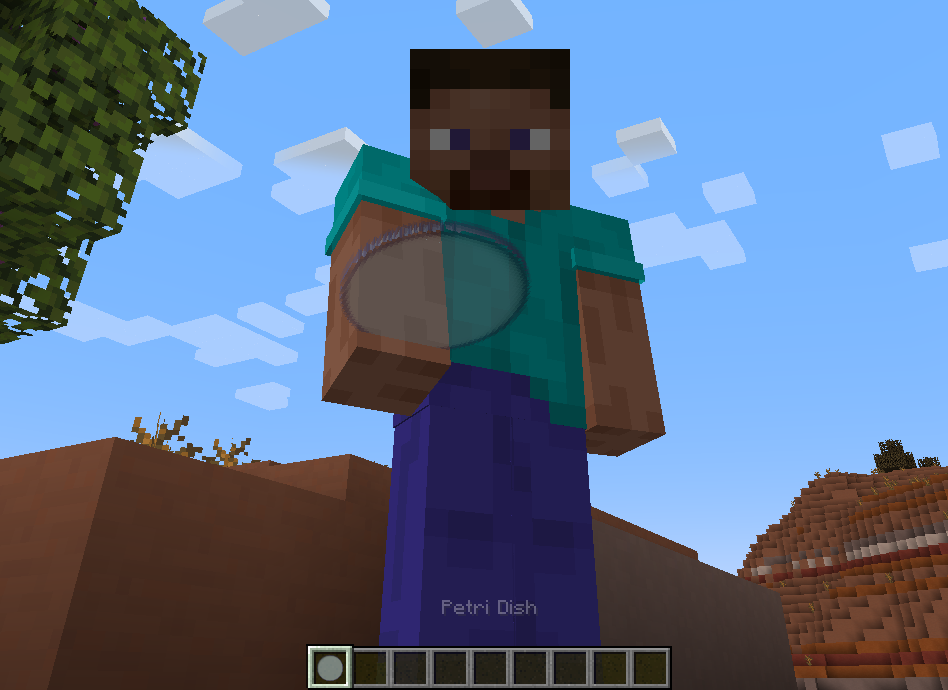

# 🧫 Minecrobes

**Minecrobes** is a Minecraft mod that brings the microscopic battle of biology into the macroscopic world. Defend your world from hostile pathogenic outbreaks, harvest bacteriophages from sludge, and farm friendly probiotic creatures. Inspired by real microbiology, it’s educational, highly strategic, and fun.

---
## 🧫 Preview

Here’s Steve proudly holding a petri dish in-game!

---

## 🔬 Gameplay Highlights

- 🦠 **The Outbreak:** Hostile Macrobacteria roam the world, spreading toxic "Biofilm" blocks that corrupt the environment.
- 🧪 **The Swab & The Lab:** Sneak up to Biofilms to swab samples with Petri Dishes, then culture them on LB Agar at your Lab Bench to identify the pathogen.
- 🛢️ **Sludge Fermentation:** Throw biological waste into a Sludge Vat to isolate wild Bacteriophages. 
- 💣 **Weaponized Biology:** Culture phages and brew them into "Phage Grenades" to melt the defenses of otherwise invincible Pathogens.
- 🐄 **Probiotic Farming:** Discover and tame friendly Macrobacteria (like *Macrobacterium bovensis*) in lush biomes to harvest medicines, crop buffs, and unique resources.
- 🏗 **Lab Infrastructure:** Upgrade from a basic Lab Bench to Laminar Flow Hoods to prevent plate contamination, and unlock Biosafety Levels (BL-1 to BL-3).

---

## 🧭 Core Loop

1. **The Threat:** A pathogenic Macrobacterium begins spreading Biofilm.
2. **The Swab:** Sneak in and collect a sample with an Empty Petri Dish.
3. **The Diagnosis:** Culture the sample in your lab to find its phage vulnerability.
4. **The Source:** Ferment waste in the Sludge Vat to isolate the correct bacteriophage.
5. **The Cure:** Weaponize the phage into a grenade to defeat the pathogen and save the biome!

---

## 🛠 Installation

This mod uses the Minecraft Forge development framework. To build or run it locally:

1. [Download and install IntelliJ IDEA](https://www.jetbrains.com/idea/)
2. Install Java 17 (we recommend [Eclipse Temurin 17.0.15+6](https://adoptium.net/temurin/releases/))
3. Clone or download this repository
4. In IntelliJ, go to **File > Open...**, navigate to the `build.gradle` file in the root of the project, and click **Open as Project**
5. Let IntelliJ finish syncing and importing the Gradle project. Once indexing is complete, you can launch the mod using the Gradle task `runClient` (found in the Gradle panel).

---

## 📂 Dev Notes
Full design notes available in docs/design_ideas.md.